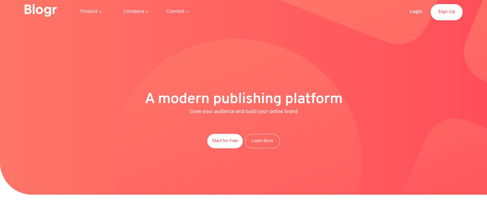
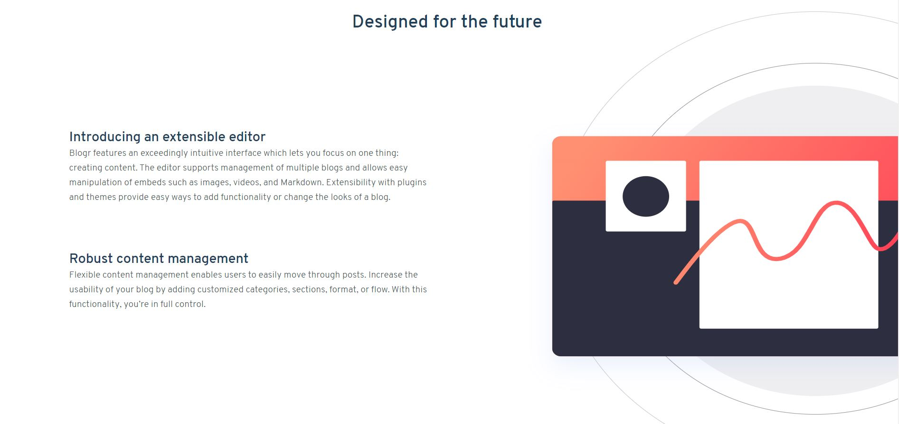
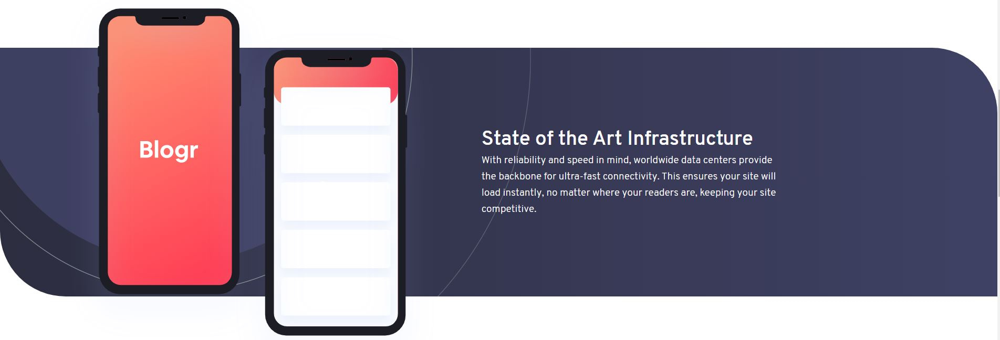
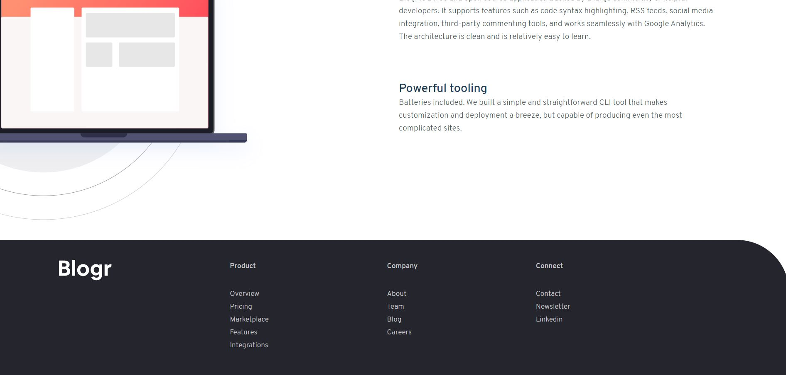

# Frontend Mentor - Blogr landing page solution

This is a solution to the [Blogr landing page challenge on Frontend Mentor](https://www.frontendmentor.io/challenges/blogr-landing-page-EX2RLAApP). Frontend Mentor challenges help you improve your coding skills by building realistic projects.

## Table of contents

- [Overview](#overview)
  - [The challenge](#the-challenge)
  - [Screenshot](#screenshot)
  - [Links](#links)
- [My process](#my-process)
  - [Built with](#built-with)
  - [What I learned](#what-i-learned)
  - [Continued development](#continued-development)
  - [Useful resources](#useful-resources)
- [Author](#author)

## Overview

### The challenge

Users should be able to:

- View the optimal layout for the site depending on their device's screen size
- See hover states for all interactive elements on the page

### Screenshot

### Links

- Solution URL: [Repo URL](https://github.com/foolhardy21/blogr-landing-page)
- Live Site URL: [Site URL](https://foolhardy21.github.io/blogr-landing-page/)

## My process

### Built with

- Semantic HTML5 markup
- CSS custom properties
- Flexbox
- JS Media Query

### What I learned

I learnt about overlay background and respective CSS properties. Along with this, I learnt using JS Media Query to make the site more responsive and dynamic.

### Continued development

I still have to work on the navigation menu for mobile viewport width.

### Useful resources

- [W3schools](https://www.w3schools.com) - This helped in dealing with the background position and dropdown menu in navigation bar.

## Author

- Frontend Mentor - [@foolhardy21](https://www.frontendmentor.io/profile/foolhardy21)
